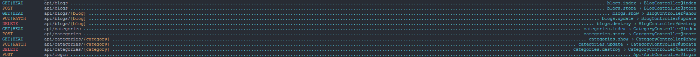

## BlogAtuh

BlogAtuh is a Blog Website Restful API's. Created using [Laravel](https://laravel.com) and [Laravel Sanctum](https://laravel.com/docs/9.x/sanctum).

## Installilation

Run `composer install` followed with `pnpm install` or `npm install`.

## Configuration

Before serving up, make sure to configure the `.env` file based on `.env.example`. After that, execute: `php artisan key:generate`.

## Serving Up

Execute in following order:

- `pnpm dev` or `npm run dev`
- `php artisan serve`

## Testing

> Notice: It's advised before you run the test to create a .env.testing file first.

BlogAtuh comes with Features Tests by default. The test are created using [Pest PHP](https://pestphp.com/). Run the test with `php artisan test --env=testing --testsuite=Api`.

## Routes List

